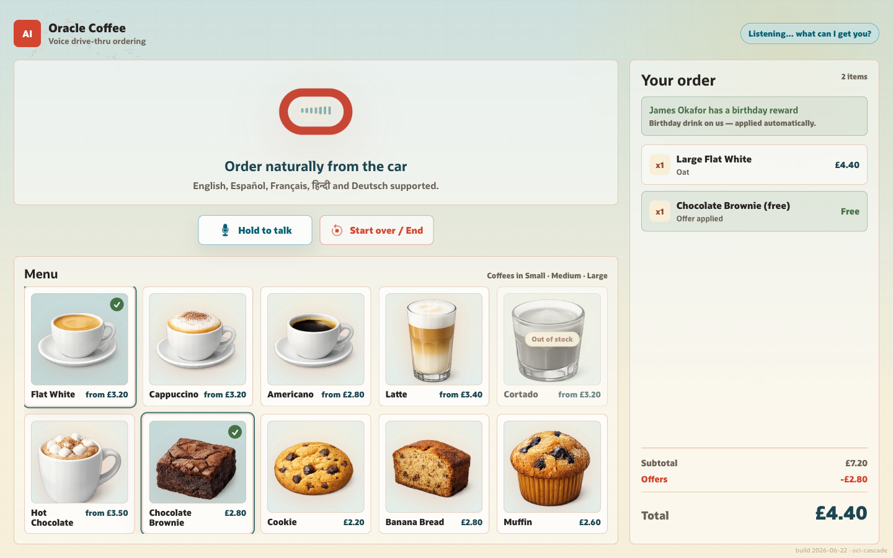
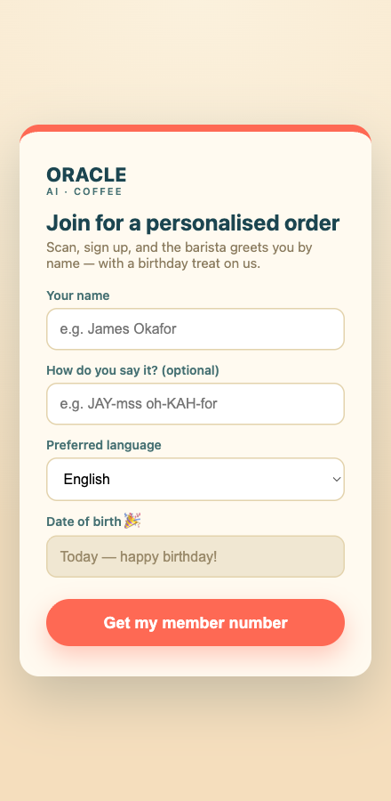

# Voice Drive-Thru

A hands-free, multilingual **voice coffee-ordering agent** for a demo booth. A customer walks up,
presses *start*, and orders by voice; the order renders live on a kiosk screen, and loyalty members are
greeted by name with a birthday treat.

The voice agent is an **exclusive Oracle Cloud (OCI) cascade**:

| Stage | Service |
|-------|---------|
| **STT** | OCI Speech (realtime) |
| **LLM** | OCI Generative AI — `openai.gpt-oss-20b` |
| **TTS** | OCI Generative AI — xAI Grok TTS |

Turn-taking (Silero VAD + the LiveKit turn-detector) and WebRTC transport are handled by
[LiveKit Agents](https://docs.livekit.io/agents/) (`1.5.17`, self-hosted).



> The kiosk renders the order live as the customer speaks; loyalty members are greeted by name with
> rewards applied automatically. Open the kiosk with `?preview` for this no-microphone view.

- **Live URL (booth):** `https://oracle-aicoe.com/voice-drivethru/`
- **Operator runbook:** [`deploy/RUNBOOK.md`](deploy/RUNBOOK.md)

---

## What it does

- **Hands-free voice ordering** — speak naturally; Silero VAD + the turn-detector own turn-taking. An
  optional hold-to-talk button (or the **Enter** key) is a *noise gate* (mutes the mic except while
  held), not turn ownership.
- **Multilingual** — English, Español, Français, हिन्दी, Deutsch. Greets in English and switches when a
  member's preferred language is accepted, or the customer asks — the agent calls a `set_language` tool
  that re-tunes the OCI Speech language and the OCI Grok voice for the rest of the conversation.
- **Loyalty membership** — look up by short code (primary) or by name (phonetic + fuzzy match on Oracle
  Autonomous Database); birthday members get a free drink. QR sign-up page included. Runs in **guest
  mode** (ordering only) when no DB is configured.
- **Promotions, applied live** — buy 2 drinks → cheapest pastry free; birthday → cheapest drink free.
  Discounts show in the running total as the order is built, not only at confirmation.

## Membership sign-up

Attendees join the loyalty programme in seconds by scanning a QR code — no app, just a phone. They enter
their name (and optionally how to pronounce it) and a preferred language, and instantly get a **4-digit
member number** to say at the booth. The barista then greets them by name, offers to continue in their
preferred language, and gives birthday members a free drink. Members are stored in Oracle Autonomous
Database; with no DB configured the booth still runs in guest mode.

<p align="center"></p>

The page is served at `/signup` (the QR target) and submits to `POST /api/signup`; printable QR posters
live in [`deploy/booth-qr/`](deploy/booth-qr/).

## Architecture

One **persistent `AgentSession`** owns the room, audio, order state, and tools. `agent/brain.py`
builds the single OCI cascade brain via `make_brain`; a per-customer reset or a runtime language switch
is just `session.update_agent(make_brain(...))`. Tools, order state, DB, and UI are brain-independent.

```
Kiosk browser (LiveKit client)            OCI VM (self-hosted)
 ├─ mic + WebRTC AEC                       ├─ LiveKit OSS server (per-tab room booth-<uuid>)
 ├─ speaker playback        ◄──WebRTC──►   ├─ ONE AgentSession, ONE brain:
 ├─ kiosk UI: live order                   │     OCI Speech STT → gpt-oss-20b LLM → OCI Grok TTS
 └─ press-to-start / hold-to-talk          │     + Silero VAD + multilingual turn-detector
                                           ├─ web backend (token mint, menu, QR sign-up)
 Member phone ─► QR sign-up ─► ADB         └─ Oracle ADB (members + orders)
```

Each kiosk **browser tab gets its own room** (`booth-<uuid>`) and therefore its own auto-dispatched
agent/session — no cross-talk between concurrent users; a reload rejoins the same room.

## Repo layout

```
agent/            # the agent worker
  main.py         #   worker entrypoint (LiveKit dispatch)
  supervisor.py   #   owns the one AgentSession: per-customer reset, language switch, press-to-start, teardown
  brain.py        #   make_brain — the single OCI cascade (STT/LLM/TTS + Silero VAD + turn-handling)
  tools.py        #   @function_tool: update_cart · lookup_member · set_birthday_drink · set_language · confirm_order
  order_state.py  #   in-memory order + idempotent promotions + versioned data-channel envelope
  menu.py         #   locked menu + the multilingual system prompt
  db.py           #   Oracle ADB (python-oracledb thin async, wallet mTLS): member lookup + order persist
  oci_stt.py      #   OCI Speech (realtime) STT plugin
  oci_grok_tts.py #   OCI Generative AI xAI Grok TTS plugin
  config.py · data_channel.py · userdata.py
web/server.py     # FastAPI: LiveKit token mint, menu, QR sign-up, healthz; serves the UIs
frontend/         # kiosk UI (press-to-start, live order, hold-to-talk)
qr_signup/        # membership sign-up page (QR target)
deploy/           # systemd units, nginx include, VM setup scripts, RUNBOOK, booth QR posters
schema.sql        # ADB schema (VOICEDT) + menu seed
tests/            # offline logic tests (order state, promotions, tools, token mint, brain, supervisor)
```

## Prerequisites

- Python 3.11–3.13 and [`uv`](https://docs.astral.sh/uv/).
- The [`livekit-server`](https://docs.livekit.io/home/self-hosting/local/) binary.
- **OCI credentials** (two mechanisms — both required):
  - An **OCI Generative AI API key** → `OCI_GENAI_API_KEY` (the LLM **and** Grok TTS). Mint it in the
    OCI Console: *Analytics & AI → Generative AI → API Keys*.
  - A valid **`~/.oci/config`** (DEFAULT profile) for **OCI Speech STT** (IAM signer). Set
    `OCI_COMPARTMENT_ID` if your Speech usage isn't in the tenancy root.
  - An IAM policy allowing the GenAI API-key principal to `use generative-ai-family` in that
    compartment, e.g. `allow any-user to use generative-ai-family in compartment <name> where ALL
    {request.principal.type='generativeaiapikey'}`.
- (Optional) An Oracle ADB wallet for membership.

## Quick start (local)

```bash
# 1. install dependencies
uv sync

# 2. pre-fetch the turn-detector model once (first run otherwise stalls)
uv run python -m livekit.agents download-files

# 3. configure — copy the template and fill in your OCI keys (see Configuration)
cp .env.example .env

# 4. run the three processes (separate terminals)
livekit-server --dev                                       # local SFU (devkey/secret)
uv run python -m agent.main start                          # the agent worker
uv run uvicorn web.server:app --host 127.0.0.1 --port 7871 # web + UIs

# 5. open the kiosk
open http://127.0.0.1:7871/                                # add ?preview for a no-connect screenshot view
```

The agent auto-dispatches into the kiosk's room. With no ADB configured it runs in **guest mode**
(ordering still works); set the `DB_*`/wallet vars to enable membership.

## Configuration

All tunables are env-driven and validated by `agent/config.py`; see [`.env.example`](.env.example) for
the full list. The essentials:

| Var | Purpose |
|-----|---------|
| `OCI_GENAI_API_KEY` | OCI Generative AI bearer key — the LLM **and** Grok TTS |
| `OCI_GENAI_REGION` | GenAI region (e.g. `us-ashburn-1`) |
| `OCI_GENAI_LLM_MODEL` | LLM model id (default `openai.gpt-oss-20b`) |
| `OCI_GROK_VOICE` | Grok TTS voice (default `eve`) |
| `OCI_COMPARTMENT_ID` | Compartment for OCI Speech (empty = tenancy root) |
| `MULTILINGUAL` / `DEFAULT_LANGUAGE` | language support (EN/ES/FR/HI/DE) |
| `LIVEKIT_API_KEY` / `LIVEKIT_API_SECRET` | must match `livekit.yaml` (or the `--dev` defaults `devkey`/`secret`) |
| `DB_*` / `WALLET_*` | Oracle ADB membership (optional; guest mode if unset) |

OCI Speech STT auth comes from **`~/.oci/config`**, not from `OCI_GENAI_API_KEY` — make sure that file
is present on the host.

## Tests

```bash
uv run pytest        # offline logic: order state + promotions, tools, token mint, brain/supervisor
```

Live integration/e2e tests (need the stack up + OCI keys, or a browser) are excluded by default — see
`tests/integration/` and `tests/e2e/`.

## Deploy

The VM runs three systemd services behind nginx — `voicedt-livekit`, `voicedt-web`, `voicedt-agent` —
served at `https://oracle-aicoe.com/voice-drivethru/`. See [`deploy/`](deploy/) and the operator
[`RUNBOOK.md`](deploy/RUNBOOK.md). The agent and web code are cross-platform; on Windows run the
same three processes (LiveKit server, `python -m agent.main start`, `uvicorn web.server:app`) as services.

## Secrets

Secrets are **never committed**. Local dev uses a gitignored `.env`; the VM uses a root-owned
`EnvironmentFile`. `.gitignore` excludes `.env`, `wallet/`, `*.pem`, `cwallet.sso`, and `*_wallet.zip`.
The OCI Speech IAM key lives in `~/.oci/config` (outside the repo).
